# WebTask no GRID/FLEX, JS
---
Фріласн завдання із університетського курсу по веб програмуванню.
Примітка: у завданні потрібно було не використовувати або мінімізувати викорисання CSS властивостей FLEX та GRID та JavaScript.
Для зручності надсилання усе було виконано в 1 HTML файлі
## Макети:
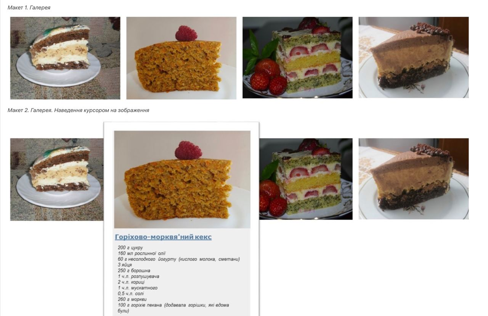
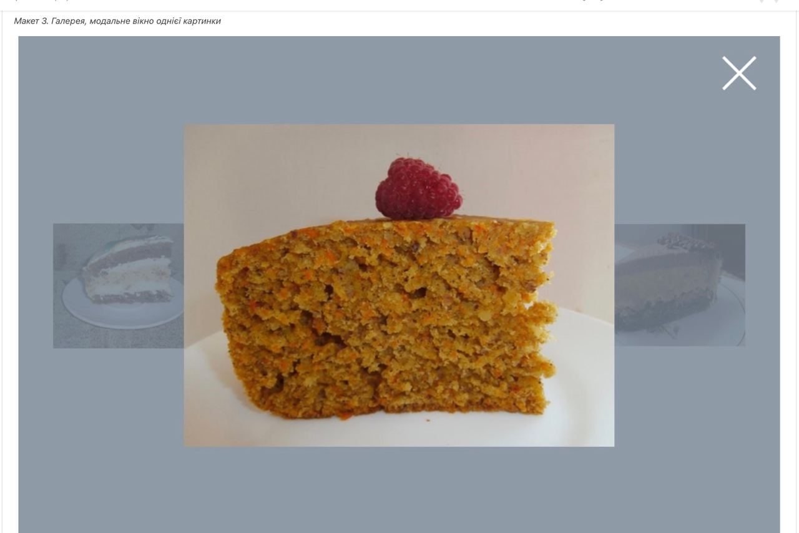
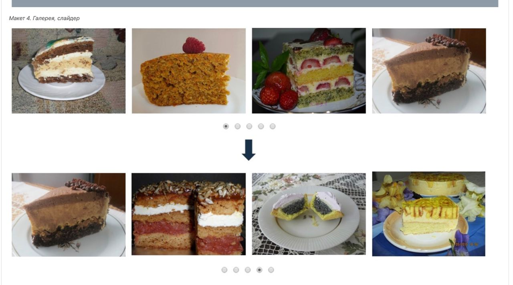
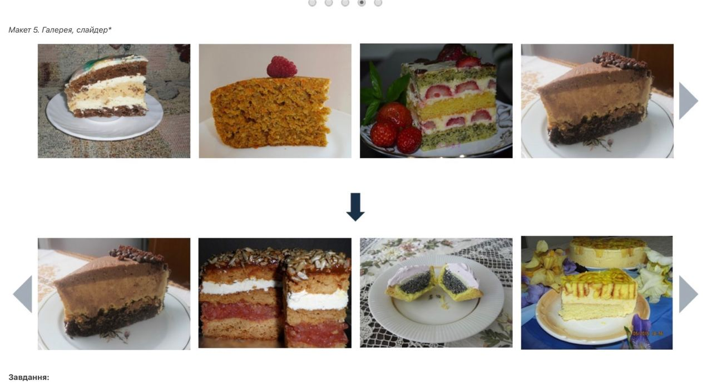
## Завдання 1:
На сторінці відображається 4 фотографії страв (Макет №1)
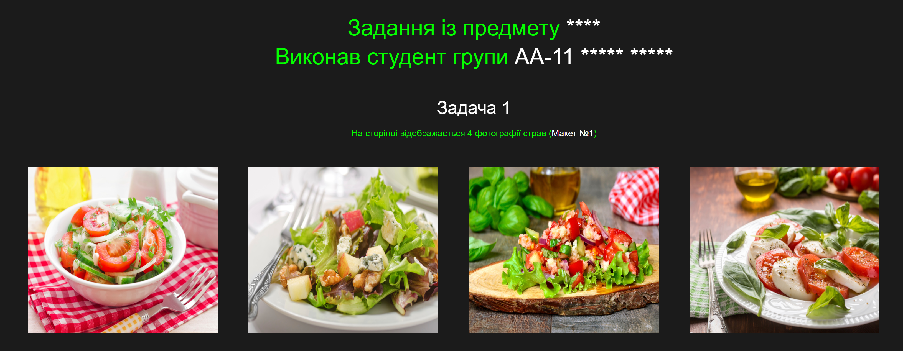
## Завдання 2:
При наведенні на фотографію з’являться карточка з описом рецепту (Макет №2)
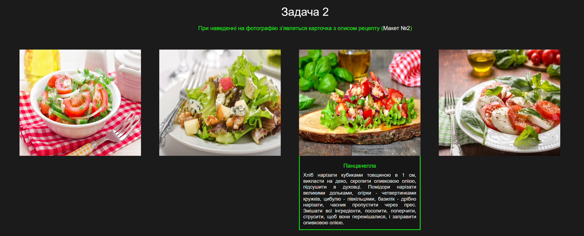
## Завдання 3:
* При кліку на фотографію з’являється модальне вікно з великою фотографією страви (Макет №3):
    * Фотографія має вміщатися у відведені рамки, навіть якщо оригінал фотографії є більшим за нього
    * Модальне вікно – це затемнення на усю сторінку
    * У правому верхньому кутку – хрестик, який закриває модальне вікно

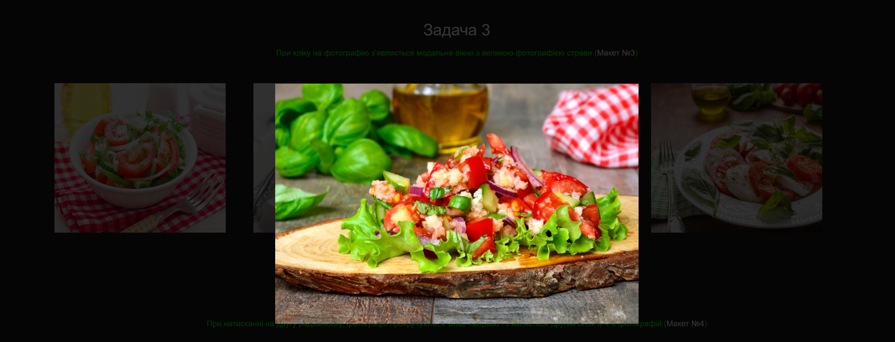
(Для цього завдання було використона 2 рядка JS)
## Завдання 4:
Під фотографіями страв – розміщуються радіокнопки, за замовченням обрана перша. При натисканні на другу радіокнопку, фотографії прокручуються зліва-направо і з’являється другий блок із 4-х фотографій (Макет №4)
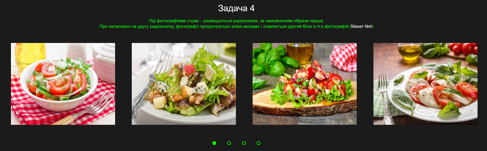
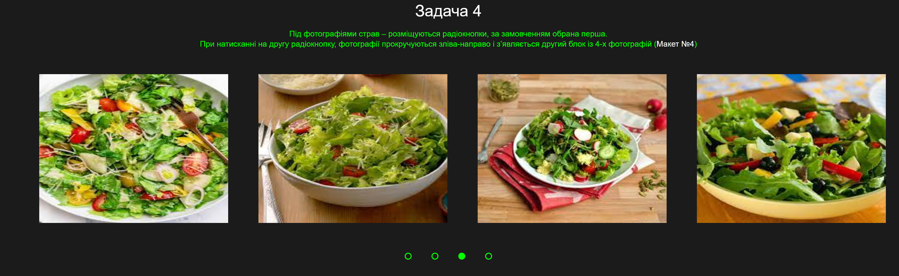
## Завдання 5:
Слайдер з радіокнопками виглядає старомодно, краще зробити перемикання стрілками (Макет №5). При натисканні на сіру стрілку вправо, фотографії прокручуються зліва-направо і показується наступний блок з 4-х фотографій. При натисканні на сіру стрілку вліво, фотографії прокручуються справа-наліво і показується попередній блок з 4-х фотографій.
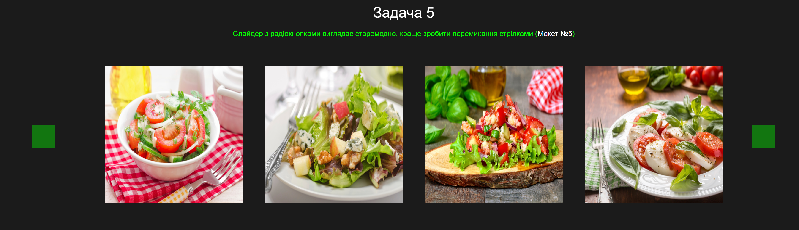
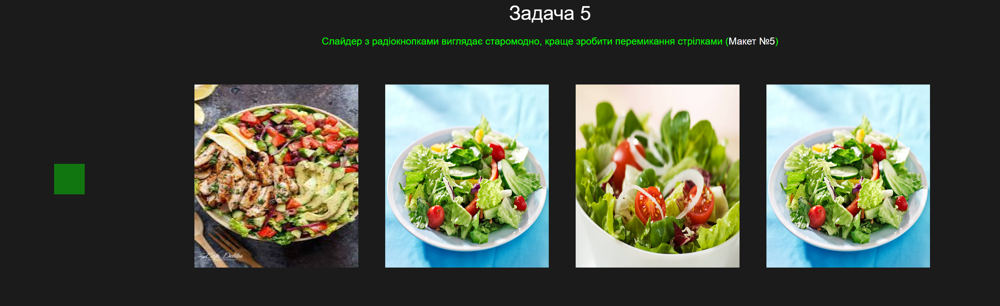

---
На проект було потрачено біля 4-5 годин